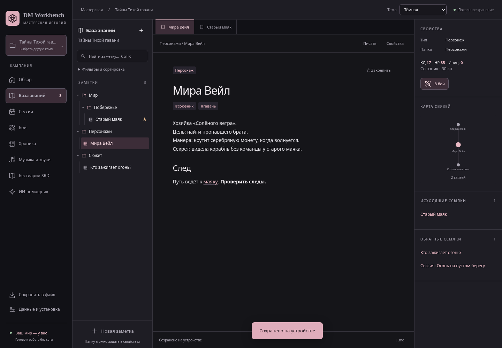

  

<h1 align="center">SADOW</h1>

  <strong>CS student exploring Linux, automation, and reliable systems.</strong> 
  Working toward junior Linux sysadmin &amp; DevOps roles.

  
  &nbsp;
  

 

## Featured project

### [DM Workbench](https://github.com/Csadow/dm-workbench) · your campaign, on your machine

An offline Linux desktop workspace for tabletop game masters. Campaign notes, combat, audio, and an optional local AI assistant—all in one place, with data stored on your device.

  <code>Linux</code> &nbsp; <code>JavaScript</code> &nbsp; <code>Electron</code> &nbsp; <code>SQLite</code> &nbsp; <code>GitHub Actions</code> &nbsp; <code>Ollama</code>

Desktop prototype · Linux x64 · Russian interface · Screenshot from browser compatibility mode

The systems work behind the interface:

| Build &amp; verify | Store &amp; recover |
| :--- | :--- |
| Portable Linux packaging and automated browser, desktop, and restart checks. | SQLite transactions, a file-write journal, and full backup/restore checks. |
| [Explore the CI workflow →](https://github.com/Csadow/dm-workbench/blob/main/.github/workflows/check.yml) | [Explore the storage tests →](https://github.com/Csadow/dm-workbench/blob/main/tests/desktop-storage.test.mjs) |

**Local services, logs, configuration, and troubleshooting:** [read the Linux operations guide →](https://github.com/Csadow/dm-workbench/blob/main/docs/linux-operations.md)

 

## What's next

I'm interested in Linux troubleshooting, service management, networking, and repeatable deployment. My current projects are a starting point for developing those skills through practical work.

I'd like to join a team where I can contribute, learn from experienced engineers, and grow into systems work.

---

  <strong>Let's build something useful.</strong> 
  Open to junior roles and internships 
  <a href="mailto:sadow1016@gmail.com">sadow1016@gmail.com</a>

Header: <a href="https://umamusume.jp/character/foreveryoung">Forever Young · Uma Musume: Pretty Derby</a> · © Cygames, Inc.

